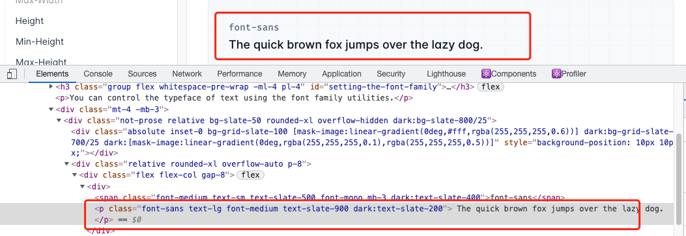
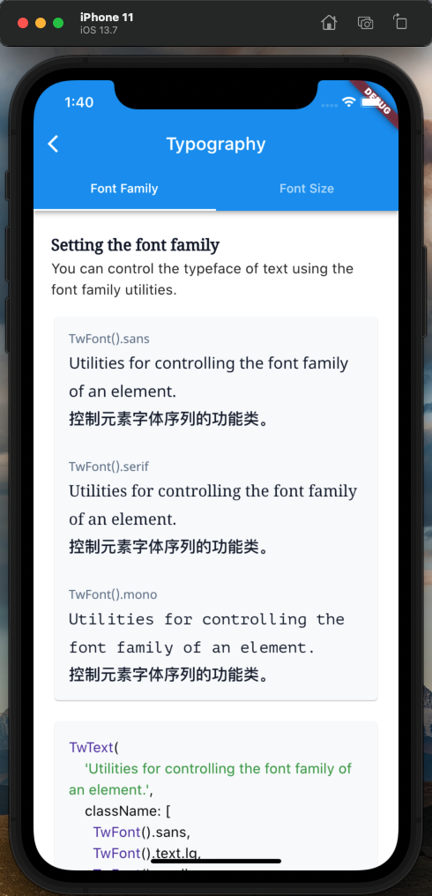

# flutter_tailwindcss

体验用 tailwind 的方式去写 flutter 样式

> 温馨提示：体验一下就完事了，别真的用到项目上。

## 介绍

[中文](./README_ZH.md) | [English](./README.md)

### 如何使用

```
dependencies:
  flutter_vant_kit: ^0.0.4
```

## 进度

| doing      | name           | verison |
| ---------- | -------------- | ------- |
| 🚀 done    | `TwColor`      | `0.0.2` |
| 🚀 done    | `Spacing`      | `0.0.3` |
| 👷 doing   | `TwText`       | -       |
| 👷 doing   | `TwFont`       | -       |
| ⏳ planing | `BorderRadius` | -       |
| ⏳ planing | `BorderWidth`  | -       |
| ⏳ planing | `Divide`       | -       |
| ⏳ planing | `Shadow`       | -       |

## 基础属性

### colors


### spacing


但从属性上来看这是一个略显鸡肋的东西，在我个人写 demo 的时候发现了不能设置多个方向和不同数值。

后面会从`复合型Widget`上面考虑，这样结合起来，可能会更加实用。

## 复合型 Widget

### TwText

`TwText` 和 `TwFont` 结合使用，TwText 相当于 flutter 中的 Text 只不过多了一个`className`参数。

### 与`tailwind`对比一下



```html
<p class="font-sans text-lg font-medium text-slate-900">
  The quick brown fox jumps over the lazy dog.
</p>
```

```dart
TwText(
    'The quick brown fox jumps over the lazy dog.', className: [
    /// 文字等宽
    TwFont().sans,
    /// 文字大小 + 行高
    TwFont().text.lg,
    /// 文字颜色
    TwFont().slate.shade900,
    /// 加粗
    TwFont().medium
])
```

> 因为 TwFont 是一个类，所以无需安装插件，也可做到智能提示

### 可用属性

| 属性           | 用法                          | tailwind                                                      |
| -------------- | ----------------------------- | ------------------------------------------------------------- |
| Font Family    | `TwFont().{family}`           | [font-family](https://tailwindcss.com/docs/font-family)       |
| Font Size      | `TwFont().text.{size}`        | [font-size](https://tailwindcss.com/docs/font-size)           |
| Font Style     | `TwFont().{style}`            | [font-style](https://tailwindcss.com/docs/font-style)         |
| Font Weight    | `TwFont().{weight}`           | [font-weight](https://tailwindcss.com/docs/font-weight)       |
| Letter Spacing | `TwFont().tracking.{spacing}` | [letter-spacing](https://tailwindcss.com/docs/letter-spacing) |
| Line Height    | `TwFont().leading.{height}`   | [line-height](https://tailwindcss.com/docs/line-height)       |

## 项目中的 demo


